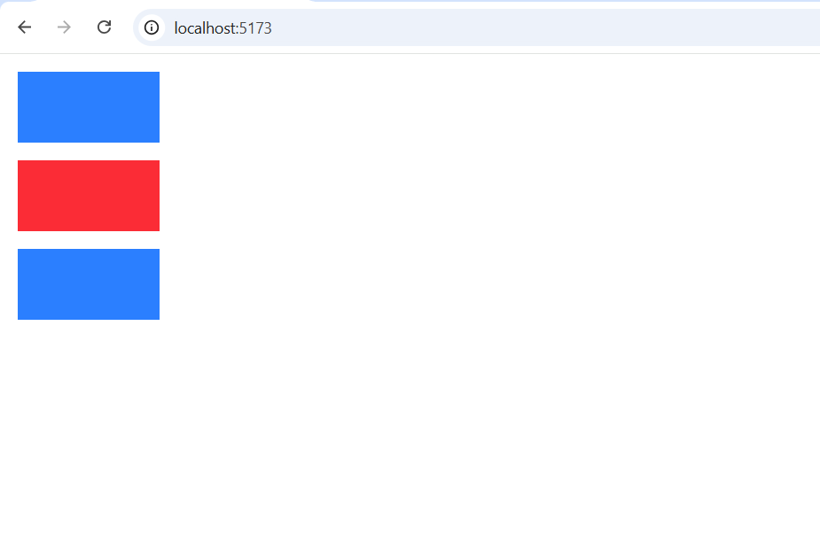
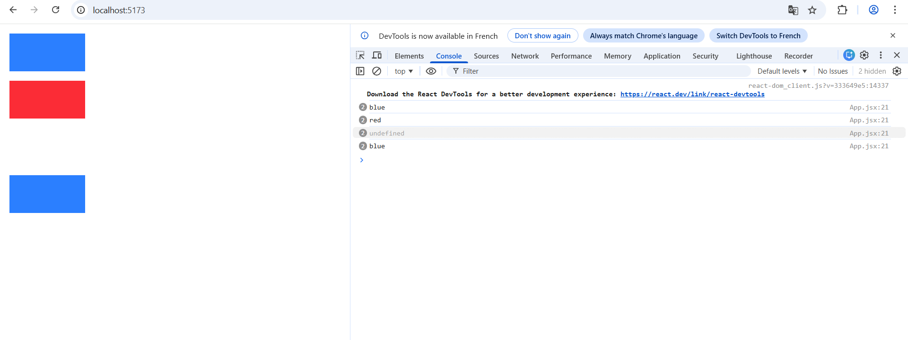
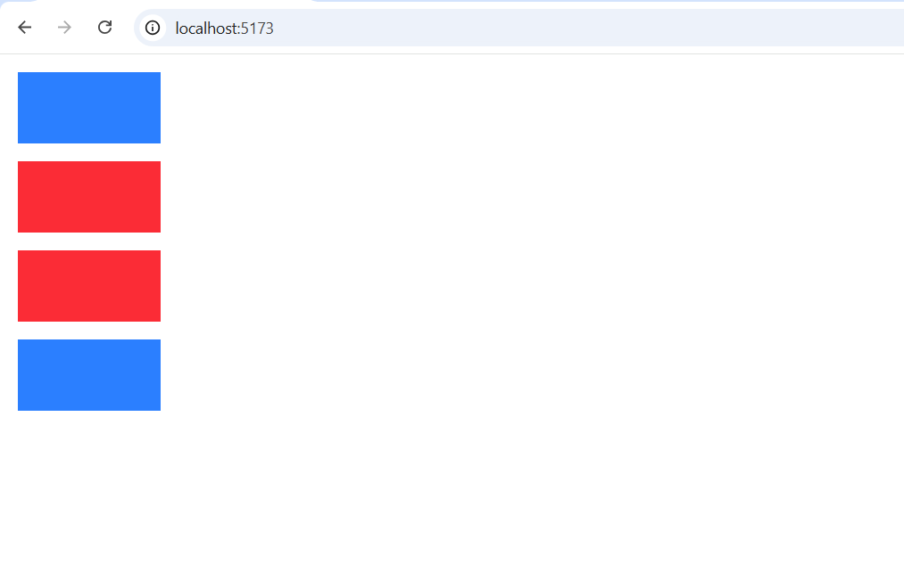
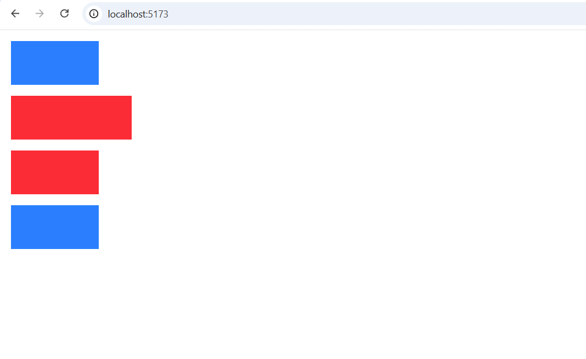
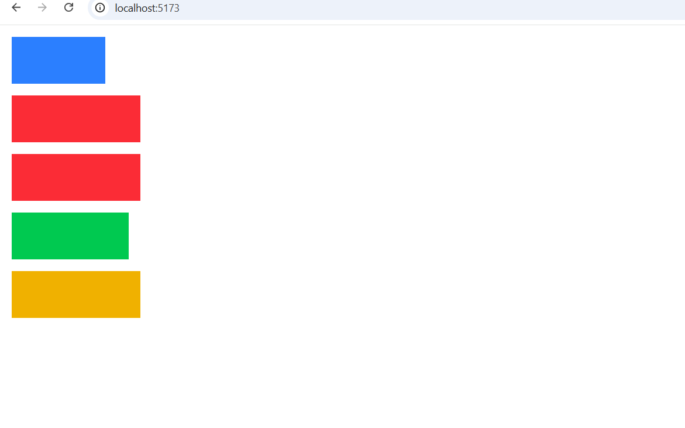
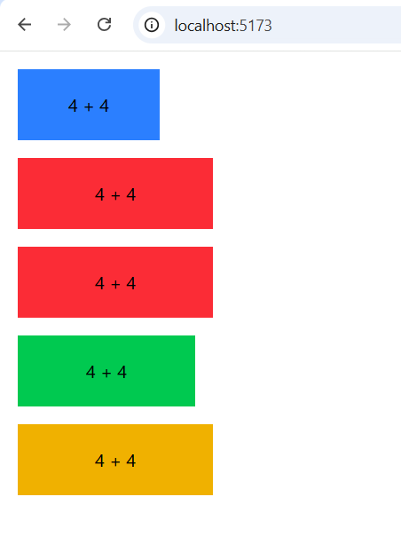
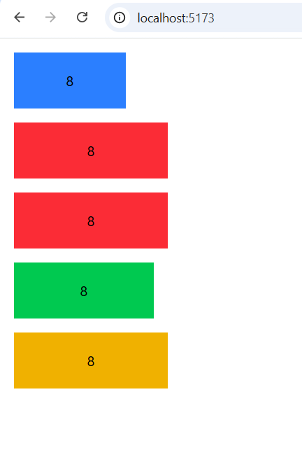
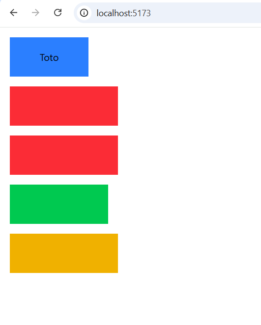

# Ma doc React

_Tuto rédigé à partir de la chaîne de [Melvynx](https://www.youtube.com/@melvynxdev) - [Apprendre REACT.JS 19 en 1 HEURE - YouTube](https://www.youtube.com/watch?v=dGMWsXyA37U)._

_Note : ce tuto se portera uniquement sur Vite + React._

# Table des matières

- [1) Qu'est-ce que React ?](#1-Qu'est-ce-que-React-)
- [2) Les installations](#2-Les-installations)
- [3) Les composants](#3-Les-composants)

# 1) Qu'est-ce que React ?

**React** est une bibliothèque JavaScript pour construire des interfaces utilisateur interactives. Voici pourquoi j'ai choisi de l'apprendre :

**Accessibilité et popularité** — React est la bibliothèque front-end la plus utilisée au monde. L'écosystème est massif, la communauté très active, et les ressources pour débuter sont abondantes. C'est un choix sûr pour progresser rapidement même en tant que débutant.

**Organisation et réutilisabilité** — Contrairement aux projets vanilla (HTML/CSS/JS séparés), React utilise les **composants réutilisables**. Un bouton, un formulaire, une card — je les crée une fois et les réutilise partout. Fini la duplication de code !

**JSX : le meilleur des deux mondes** — React permet d'écrire du JavaScript et du HTML ensemble dans une syntaxe appelée **JSX** (ou TSX pour TypeScript). C'est intuitif et plus lisible qu'une architecture traditionnelle.

**Single Page Application (SPA)** — React construit des applications avec une seule page HTML. Au lieu de créer 10 fichiers HTML séparés, une application React gère le rendu dynamiquement. Plus léger, plus rapide, plus efficace.

**Les Hooks** — Avec les hooks (comme `useState` et `useEffect`), je peux gérer l'état et les effets directement dans mes composants de façon élégante. C'est puissant et c'est quelque chose que je veux maîtriser.

**En résumé** — React m'enseigne comment structurer une application front-end de façon professionnelle, tout en restant accessible pour un débutant.

# 2) Les installations

Prérequis :
- avoir installé Node JS et Tailwind CSS
- créer un projet et installer Vite + React

Pour installer Vite, tape `npm create vite@latest`.

-> Après l’installation, Vite va demander un nom du projet. 
Il demandera également de choisir un framework (donc React pour nous) et ensuite un langage de programmation (on va prendre JavaScript ou TypeScript recommandé pour une API en Nest JS).


**On peut à présent ouvrir l’éditeur de code.**

Voici les fichiers de départ :


Voici l'explication du rôle de chaque fichier dans ce projet React + Vite :

**Fichiers de configuration**

- **package.json** : Fichier manifest du projet. Il contient :
  - Les dépendances (React, React-DOM)
  - Les scripts npm (`dev`, `build`, `lint`, `preview`)
  - Les infos du projet (nom, version, type)

- **vite.config.js** : Configuration du bundler Vite. Active le plugin React pour transformer JSX en JavaScript standard.

- **eslint.config.js** : Configuration du linter ESLint pour détecter les erreurs et appliquer les standards de code.

**Fichiers HTML et point d'entrée**

- **index.html** : Fichier HTML principal du navigateur. Il contient :
  - Une `<div id="root">` où React va injecter l'application
  - Un script qui charge main.jsx

- **main.jsx** : Point d'entrée JavaScript de l'application React. Il :
  - Importe le composant `App`
  - Crée la racine React avec `createRoot()`
  - Rend le composant App dans le DOM

**Composants et styles**

- **App.jsx** : Composant principal de l'application (là où vous mettez votre logique métier)

- **App.css** : Styles spécifiques au composant `App`

- **index.css** : Styles globaux appliqués à toute l'application

**Dossiers**

- **public** : Dossier des fichiers statiques (images, favicon, etc.) - directement copiés dans le build final

- **assets** : Dossier pour ranger les ressources (images, fonts, etc.) du projet

**Lancer le server** `npm run dev`

Ça montre cet interface par défaut :


**Nous allons retirer l'UI de Vite.**

Dans `App.jsx` - `src/App.jsx` :

```jsx
//src/App.jsx

// Supprimer tous ces imports
import { useState } from 'react'
import reactLogo from './assets/react.svg'
import viteLogo from './assets/vite.svg'
import heroImg from './assets/hero.png'
import './App.css'

function App() {
  // Supprimer ce state
  const [count, setCount] = useState(0) 

  return (
    <>
      {/* On peut aussi tout retirer à partir de cette ligne */}
      <section id="center">
        <div className="hero">
          
          
          
        </div>
        <div>
          <h1>Get started</h1>
          <p>
            Edit <code>src/App.jsx</code> and save to test <code>HMR</code>
          </p>
        </div>
        <button
          className="counter"
          onClick={() => setCount((count) => count + 1)}
        >
          Count is {count}
        </button>
      </section>

      <div className="ticks"></div>

      <section id="next-steps">
        <div id="docs">
          <svg className="icon" role="presentation" aria-hidden="true">
            <use href="/icons.svg#documentation-icon"></use>
          </svg>
          <h2>Documentation</h2>
          <p>Your questions, answered</p>
          <ul>
            <li>
              <a href="https://vite.dev/" target="_blank">
                
                Explore Vite
              </a>
            </li>
            <li>
              <a href="https://react.dev/" target="_blank">
                
                Learn more
              </a>
            </li>
          </ul>
        </div>
        <div id="social">
          <svg className="icon" role="presentation" aria-hidden="true">
            <use href="/icons.svg#social-icon"></use>
          </svg>
          <h2>Connect with us</h2>
          <p>Join the Vite community</p>
          <ul>
            <li>
              <a href="https://github.com/vitejs/vite" target="_blank">
                <svg
                  className="button-icon"
                  role="presentation"
                  aria-hidden="true"
                >
                  <use href="/icons.svg#github-icon"></use>
                </svg>
                GitHub
              </a>
            </li>
            <li>
              <a href="https://chat.vite.dev/" target="_blank">
                <svg
                  className="button-icon"
                  role="presentation"
                  aria-hidden="true"
                >
                  <use href="/icons.svg#discord-icon"></use>
                </svg>
                Discord
              </a>
            </li>
            <li>
              <a href="https://x.com/vite_js" target="_blank">
                <svg
                  className="button-icon"
                  role="presentation"
                  aria-hidden="true"
                >
                  <use href="/icons.svg#x-icon"></use>
                </svg>
                X.com
              </a>
            </li>
            <li>
              <a href="https://bsky.app/profile/vite.dev" target="_blank">
                <svg
                  className="button-icon"
                  role="presentation"
                  aria-hidden="true"
                >
                  <use href="/icons.svg#bluesky-icon"></use>
                </svg>
                Bluesky
              </a>
            </li>
          </ul>
        </div>
      </section>

      <div className="ticks"></div>
      <section id="spacer"></section>
      {/* Jusqu'ici */}
    </>
  )
}

export default App
```
**Ça donne ça :**

```jsx
function App() {

  return (
    <>
      {/* Ajouter un p'tit mot de bienvenue */}
      <h1>Bienvenue sur notre application React !</h1>
    </>
  )
}

export default App

```


**Ensuite on va supprimer `App.css` dans** `src/App.css` **qui était appliqué à l'interface par défaut.**

Puis dans `src/index.css`, **on va retirer tout le contenu du fichier `index.css`**.

Pourquoi on supprime les lignes css ? Car nous allons utiliser **Tailwind CSS**.

**La raison ?**

Tailwind CSS offre une meilleure productivité en comparaison au CSS classique. Les avantages principaux :
- **Directement dans le JSX** : Classes utilitaires appliquées directement sur les élements
- **Pas de conflits de noms** : Classes pré-définies évitent les collisions
- **Bundle optimisé** : Seules les classes utilisées sont incluses en production
- **Responsive natif** : Breakpoints intégrés (`md:`, `lg:`, etc.)
- **États visuels faciles** : `hover:`, `focus:`, `dark:` pour les interactions
- **Design system cohérent** : Palette de couleurs et espacements uniformes

### Pour installer Tailwind CSS :

Se rendre directement dans la doc officielle de Tailwind et suivre les instructions (car les versions changent au fil du temps).

Lien : https://tailwindcss.com/docs/installation/using-vite

Maintenant qu'on a tailwind, on peut tester dans `App.jsx` - `src/App.jsx` et rajouter une ligne :

```jsx
//src/App.jsx

import { useState } from 'react'

function App() {

  return (
    <div className="bg-red-500"> {/* Ajoute ici ta classe Tailwind à l'intérieur du <>*/}
      {/* Ajouter un p'tit mot de bienvenue */}
      <h1>Bienvenue sur notre application React !</h1>
    </div>
  )
}

export default App
```

On peut voir "Bienvenue sur notre application React !" surligné en rouge :


# 3) Les composants

**Qu'est-ce qu'un composant React ?**

Un composant React est une **fonction JavaScript réutilisable** qui retourne du JSX (un mélange de JavaScript et HTML). Chaque composant représente une partie de l'interface utilisateur qu'on peut utiliser autant de fois qu'on veut.

Un composant c'est comme un bloc de construction — tu crées une fonction, elle retourne du markup, et tu peux la réutiliser partout dans ton app.

**Exemple simple :**

```jsx
function Bouton() {
  return <button>Cliquez-moi</button>
}

// Utilisation
<Bouton />
<Bouton />
<Bouton />  // Trois boutons identiques !
```

**Exemples de composants courants :**

- **Bouton** : Un bouton réutilisable avec du styling
- **Card** : Une boîte avec titre, description et image
- **Header/Navbar** : La barre de navigation en haut
- **Footer** : Le pied de page
- **Formulaire** : Un formulaire avec champs et validation
- **Liste** : Affiche une liste d'éléments (posts, produits, etc.)
- **Modal** : Une fenêtre popup
- **Avatar** : Image de profil utilisateur
- **Commentaire** : Un commentaire avec auteur et contenu

**Pourquoi les composants c'est puissant ?**

- **Réutilisabilité** : Crée une fois, utilise partout
- **Maintenabilité** : Si tu dois changer un bouton, tu le fais à un seul endroit
- **Clarté** : Ton code est organisé et facile à comprendre
- **Modularité** : Tu peux composer des petits composants pour créer de grands composants

## React vs JavaScript Vanilla

La différence principale entre **React et JavaScript Vanilla** est la façon de gérer l'UI et l'état.

Avec du **vanilla (HTML/CSS/JS pur)**, tu dois :
- Manipuler le DOM directement avec `document.getElementById()`, `appendChild()`, etc.
- Gérer manuellement les mises à jour : si une donnée change, tu dois trouver l'élément et le modifier à la main
- Créer beaucoup de fichiers HTML séparés pour chaque page
- Écrire beaucoup de code répétitif pour synchroniser l'état avec l'interface

Avec **React**, tu :
- Déclares l'UI avec des composants (fonctions JavaScript)
- React gère automatiquement les mises à jour du DOM quand l'état change
- Construis une Single Page Application où tout se passe sur une seule page HTML
- Écris du code plus propre, plus lisible et moins répétitif

**Exemple simple** : Si tu veux afficher un compteur qui s'incrémente au clic.

*En Vanilla :*
```javascript
let count = 0;
document.getElementById('button').addEventListener('click', () => {
  count++;
  document.getElementById('count').textContent = count;
});
```

*En React :*
```jsx
function Compteur() {
  const [count, setCount] = useState(0);
  return (
    <div>
      <p>Count: {count}</p>
      <button onClick={() => setCount(count + 1)}>Incrémenter</button>
    </div>
  );
}
```

React c'est plus intuitif : tu décris l'UI une fois, et React s'occupe du reste ! 🚀

Par ailleurs, on va pouvoir utiliser des **variants** (un concept très utilisé avec Tailwind / composants UI.) telles que :

- `primary` → bouton principal
- `secondary` → bouton secondaire
- `ghost` → bouton transparent
- `danger` → bouton rouge

**Exemple avec un bouton :**

```jsx
function Button({ variant, children }) {
  let style = ""

  if (variant === "primary") {
    style = "bg-blue-500 text-white"
  } else if (variant === "secondary") {
    style = "bg-gray-500 text-white"
  } else if (variant === "ghost") {
    style = "bg-transparent border border-gray-500"
  }

  return (
    <button className={`px-4 py-2 rounded ${style}`}>
      {children}
    </button>
  )
}
``` 

## On va créer nos premiers composants

Dans `App.jsx` - `src/App.jsx` :

Étape 1 :

```jsx
//src/App.jsx

// Ajouter export default dans la fonction App
export default function App() {

  return (
    <div className="bg-red-500"> {/* Ajoute ici ta classe Tailwind à l'intérieur du <>*/}
      {/* Ajouter un p'tit mot de bienvenue */}
      <h1>Bienvenue sur notre application React !</h1>
    </div>
  )
}

// Suprimer la ligne export default App (c’est juste une écriture plus courte et plus propre 
// mais affichera une erreur sinon).
```

Étape 2, on va créer un composant lego :

```jsx
//src/App.jsx

export default function App() {

  return (
    <div className="bg-red-500">
      <h1>Bienvenue sur notre application React !</h1>
    </div>
  )
}

// Composant Lego après l'exportation de App
function Lego() {
  return <div className="bg-red-500 h-16 w-32"></div>;
}
```

À ce moment là, on définit une fonction JS pour créer un composant React et dans cette fonction, on retourne du JSX.

Étape 3, démonstration :

```jsx
//src/App.jsx

export default function App() {

  return (
    <div className="bg-red-500">
      {/* Ajouter d'autres composants ou éléments ici */}
      <Lego /> {/* Attention à bien mettre le composant en majuscule */} 
    </div>
  )
}

// Composant Lego après l'exportation de App
function Lego() {
  return <div className="bg-red-500 h-16 w-32"></div>;
}
```

Résultat :


On va transformer le bloc rouge pour le rendre plus semblable à une brique de lego :

```jsx
//src/App.jsx

// Modifier la ligne div className
return (
    <div className="p-4 flex flex-col gap-4"> {/* Remplacer le bg-red par un padding */}
      <Lego />
    </div>
  )
```


On a créé notre **premier composant** ! Ce qui veut dire qu'on va pouvoir réutiliser **plusieurs fois**.

Par exemple, on peut s'amuser à dupliquer plusieurs fois comme ceci :

```jsx
//src/App.jsx

export default function App() {

  return (
    <div className="p-4 flex flex-col gap-4">
      <Lego />
      {/* On peut dupliquer le composant Lego autant de fois que nécessaire */}
      <Lego />
      <Lego />
      <Lego />
    </div>
  )
}

function Lego() {
  return <div className="bg-red-500 h-16 w-32"></div>;
}
```


## Un autre concept intéressant en React avec les composants, on peut les faire passer des props (propriétés).

Qu’est-ce qu’une prop ?

- **Prop** = **propriété** que tu passes d’un composant parent à un composant enfant.
- Elle permet de rendre un composant **dynamique** et **réutilisable**.
- C’est un peu comme donner des **paramètres à une fonction**, mais pour un composant.

Voici un exemple :

```jsx
//src/App.jsx

export default function App() {

  return (
    <div className="p-4 flex flex-col gap-4">
      {/* Exemple d'utilisation des Legos avec différentes couleurs.

          Comme on le voit ci-dessous, les couleurs : blue, red, blue sont des 
          propriétés de chaque composant Lego. Ce sont des props ! */}

      <Lego color="blue" />
      <Lego color="red" />
      <Lego color="blue" />
    </div>
  )
}

function Lego(props) { // Ajout des props pour personnaliser les Legos
  let classes = "h-16 w-32"; // Classes communes à tous les Legos

  // Si la prop color est "blue", on ajoute la classe de fond bleu
  if (props.color === "blue") {
    classes += " bg-blue-500";
  }

  // Si la prop color est "red", on ajoute la classe de fond rouge
  if (props.color === "red") {
    classes += " bg-red-500";
  }

  return <div className={classes}></div>;
}
```


**Remarque : React vient éxecuter le composant lego avec des props (les couleurs), puis récupère le résultat et se charge de nous l'afficher.

Plus simple encore, un composant React fonctionne comme une fonction classique.
On lui passe des **props** (comme des arguments), il génère du JSX en fonction de ces valeurs, puis React affiche le résultat à l’écran. 

On peut faire plus simple, on va créer un **objet** `COLORS` :

```jsx
//src/App.jsx

export default function App() {

  return (
    <div className="p-4 flex flex-col gap-4">

      <Lego color="blue" />
      <Lego color="red" />
      <Lego color="blue" />
    </div>
  )
}

// On peut aussi définir un objet pour stocker les classes de couleurs, 
// ce qui rend le code plus propre et plus facile à maintenir.
const COLORS = {
  blue: "bg-blue-500",
  red: "bg-red-500",
}

function Lego(props) {
  return <div className={`h-16 w-32 ${COLORS[props.color]}`}></div>;
}
```

## Créer des props par défault

**Problématique : que se passerait-il si une prop n'est pas définie ?

Exemple : 

```jsx
//src/App.jsx

export default function App() {

  return (
    <div className="p-4 flex flex-col gap-4">

      <Lego color="blue" />
      <Lego color="red" />
      <Lego /> {/* Ici */}
      <Lego color="blue" />
    </div>
  )
}
```

`<Lego /> {/* Ici */}` cette prop crée une brique sans couleur car elle n'est pas définie.

**Ce qu'on veut faire ?** C'est d'ajouter une prop par défaut.

Pour se faire, on va utiliser la déstructuration.

```jsx
//src/App.jsx

// En dessous de const COLORS

function Lego(props) {
  const { color } = props; // Ici, on va déstructurer l'objet en JS pour récupérer une variable. 
  console.log(color); // Pour afficher la sortie des couleurs dans la console du navigateur
  return <div className={`h-16 w-32 ${COLORS[props.color]}`}></div>;
}
```
Dans la console :



La ligne `const { color } = props;` “déstructure” l’objet props.
C’est comme dire : “Prends la propriété color de l’objet props et mets-la dans une variable appelée color”.

**Mais** au lieu de faire ça dans une autre ligne, on peux aussi faire : 

```jsx
//src/App.jsx

// En dessous de const COLORS

function Lego({color = "red"}) { // Ça rajoute la valeur par défaut "red"
  return <div className={`h-16 w-32 ${COLORS[color]}`}></div>; // enlève le "props." devant "color" pour utiliser la variable locale
}
```


Mais encore, on peut ajouté autant de props par défaut qu'on souhaite. Par exemple :

```jsx
// src/App.jsx

export default function App() {

  return (
    <div className="p-4 flex flex-col gap-4">
      <Lego color="blue" />
      <Lego color="red" size="lg" /> 
      <Lego />
      <Lego color="blue" />
    </div>
  )
}

const COLORS = {
  blue: "bg-blue-500",
  red: "bg-red-500",
}

// Ici size, une nouvelle prop
const SIZE = {
  sm: "w-32",
  lg: "w-44",
};

function Lego({color = "red", size = "sm" }) {  // On peut rajouter une nouvelle prop "size"
  return <div className={`h-16 w-32 ${COLORS[color]} ${SIZE[size]}`}></div>; // Rajout de SIZE
}
```

Grâce à size, on peux faire ça :

```jsx
// src/App.jsx

export default function App() {

  return (
    <div className="p-4 flex flex-col gap-4">
      <Lego color="blue" />
      <Lego color="red" size="lg" /> {/* Par exemple */}
      <Lego />
      <Lego color="blue" />
    </div>
  )
}

const COLORS = {
  blue: "bg-blue-500",
  red: "bg-red-500",
}

const SIZE = {
  sm: "w-32",
  lg: "w-44",
};

function Lego({color = "red", size = "sm" }) {
  return <div className={`h-16 ${COLORS[color]} ${SIZE[size]}`}></div>; // Enlever w-32
}
```



Voilà, on peux s'amuser à faire changer la taille et la couleur du lego en fonction de l'état du composant, ou même faire un composant qui affiche une pile de legos !

```jsx
// src/App.jsx

export default function App() {

  return (
    <div className="p-4 flex flex-col gap-4">
      <Lego color="blue" />
      <Lego color="red" size="lg" />
      <Lego size="lg" />
      <Lego color="green" size="md" />
      <Lego color="yellow" size="lg" />
    </div>
  )
}

const COLORS = {
  blue: "bg-blue-500",
  red: "bg-red-500",
  green: "bg-green-500",
  yellow: "bg-yellow-500",
}

const SIZE = {
  sm: "w-32",
  md: "w-40",
  lg: "w-44",
};

function Lego({color = "red", size = "sm" }) {
  return <div className={`h-16 ${COLORS[color]} ${SIZE[size]}`}></div>;
}
```



**La puissance des composants, c'est donc d'utiliser de la logique à plusieurs endroits !**


## Les éléments enfants

Il est possible d'ajouter du contenu à nos composants et pour rajouter ces contenus, on utilise une prop spéciale appelée `children`.

```jsx
// src/App.jsx

// Après const SIZE = {

function Lego({color = "red", size = "sm", children}) { //Ajout du paramètre children
  return <div className={`h-16 ${COLORS[color]} ${SIZE[size]}`}></div>; // Ajout de {children}
}
```

On ajoute du contenu :

```jsx
// src/App.jsx

// Après const SIZE = {

function Lego({color = "red", size = "sm", children}) { //Ajout du paramètre children
  return <div className={`h-16 flex items-center justify-center ${COLORS[color]} ${SIZE[size]}`}>4 + 4</div>; // Ajout de {children}
```


Chaque brique affiche "**4 + 4**" à l'intérieur. Pour que 4 + 4 = `8` à l'intérieur, on met le contenu à **l'intérieur** des accolades. Les `{ }` permet d'écrire du code **JavaScript** et donc d'effectuer de la logique.   

```jsx
// src/App.jsx

// Après const SIZE = {

function Lego({color = "red", size = "sm", children}) { //Ajout du paramètre children
  return <div className={`h-16 flex items-center justify-center ${COLORS[color]} ${SIZE[size]}`}>{4 + 4}</div>; // Ajout de {children}
}
```


On peut aussi faire d'une autre manière :

```jsx
// src/App.jsx

export default function App() {

  return (
    <div className="p-4 flex flex-col gap-4">
      <Lego color="blue" >Toto</Lego> {/* <-- Affichage du contenu passé en tant qu'enfant */}
      <Lego color="red" size="lg" />
      <Lego size="lg" />
      <Lego color="green" size="md" />
      <Lego color="yellow" size="lg" />
    </div>
  )
}

const COLORS = {
  blue: "bg-blue-500",
  red: "bg-red-500",
  green: "bg-green-500",
  yellow: "bg-yellow-500",
}

const SIZE = {
  sm: "w-32",
  md: "w-40",
  lg: "w-44",
};

function Lego({color = "red", size = "sm", children}) {
  return <div className={
    `h-16 flex items-center justify-center 
    ${COLORS[color]} 
    ${SIZE[size]}`}>
      {children} {/* Affichage du contenu passé en tant qu'enfant */}
    </div>;
}
```


**Ce qu’on écrit entre les balises d’un composant est automatiquement passé dans une prop spéciale appelée `children`.**

Comme ici :
```jsx
<Lego color="blue">Toto</Lego>
```
- `color="blue"` → prop classique
- `Toto` → contenu enfant → stocké dans children

**Comment React interprète ça ?**

```jsx
<Lego color="blue">Toto</Lego>
```
Devient en interne (en JS) :
```jsx
{
  color: "blue",
  children: "Toto"
}
```

Dans ton composant :

```jsx
function Lego({ color = "red", size = "sm", children }) {
```
Tu récupères :
- `color`
- `size`
- `children` (le contenu entre les balises)

Et tu l’affiches ici :

```jsx
return (
  <div className={`h-16 flex items-center justify-center ${COLORS[color]} ${SIZE[size]}`}>
    {children}
  </div>
);
```
`{children}` = affiche le contenu passé dans le composant

En gros, children c’est simplement ce qu’il y a entre `<Lego> ... </Lego>.`
React le passe automatiquement au composant, et on peut l’afficher avec {children}.

**Bonus (très important)**

Tous les composants peuvent recevoir children, même si tu ne le déclares pas.

Par exemple :

```jsx
function Lego({ children }) {
  return <div>{children}</div>;
}
```